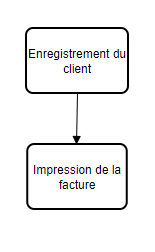
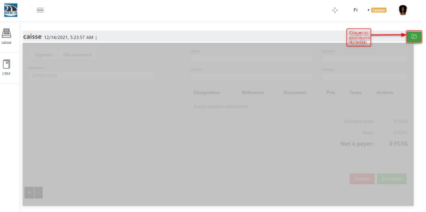
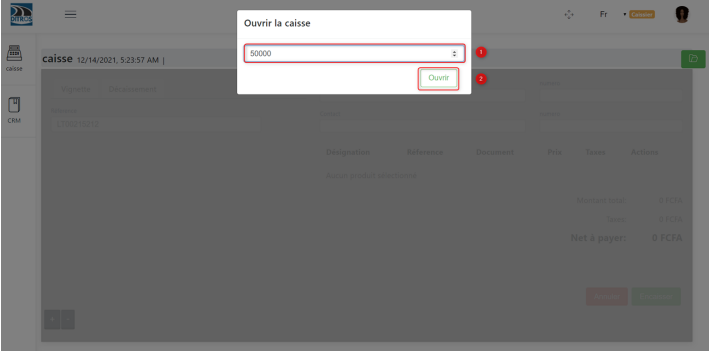
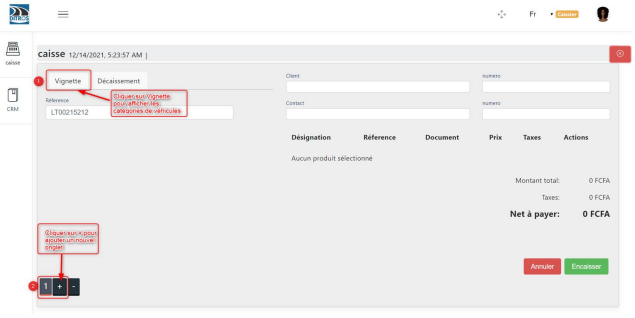
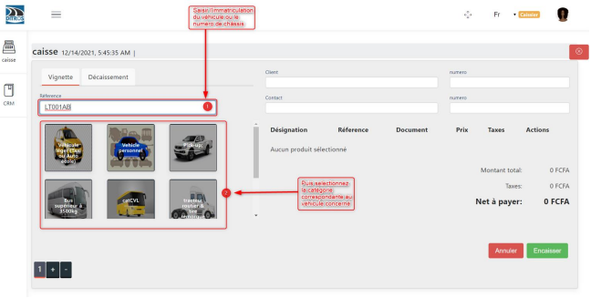
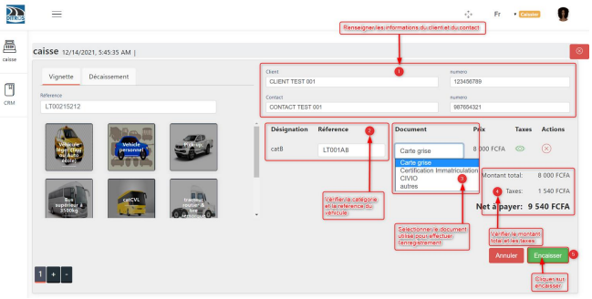
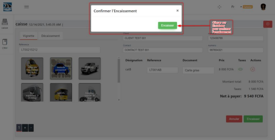
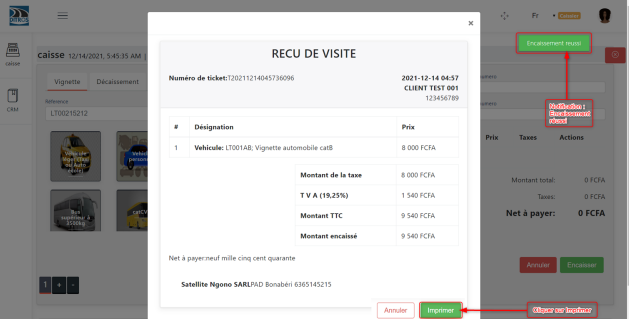

Encaissement du client
++++++++++++++++++++++

Le figure ci-dessous présente les différentes étapes à suivre pour réaliser l'encaissement d'un client

.. centered:: Etapes pour l'encaissement

Comme pré-requis, nous devons tout d'abord etre connecté en avec le rôle de caisse pour pouvoir réaliser la suite des opérations.

Enregistrement du client
========================

Les étapes d'enregistrement du client sont : 

 * **L'ouverture de la caisse**

Une fois connecté à un compte ayant le rôle de caisse, il faut procéder à **l’ouverture de la caisse** en saisissant le montant initial en possession à l’instant où l’on commence les enregistrements.

.. centered:: Ouvrir la caisse

Saisir le montant initial en caisse à l’instant de l’ouverture de la caisse.

.. centered:: Entrée du montant en caisse

Une fois la caisse ouverte, nous avons cette interface avant de commencer les enregistrements
il faut afficher les catégories de véhicules et ajouter un onglet

.. centered:: Choix de la catégorie du véhicule

* Remplir les champs

Renseigner les champs suivants à l’aide de la carte grise :
➢ Référence
➢ Sélectionner l’icône de la catégorie de véhicule correspondante
➢ Client
➢ Numéro de téléphone du client
➢ Contact
➢ Numéro de téléphone du contact
➢ Choisir le type de document qui permet d’effectuer l’enregistrement

    * Carte grise
    * Certificat d’immatriculation
    * CIVIO
    * Autre document

 Après avoir remplis les champs, cliquez sur **« Encaisser ».** Les figures ci-dessous illustrent bel et bien le processus.

.. centered:: Renseigner les informations du véhicule et du client

.. centered:: Renseigner les informations du véhicule et du client

Puis nous devons confirmer l'encaissement 

.. centered:: Confirmer l'encaissement

Impression de la facture
========================

* Impression du ticket de payement

Juste après avoir encaissé le client, nous devons imprimer sa facture.
En effet une fois l’encaissement effectué, on reçoit une notification **« encaissement réussi »**. On
peut à présent imprimer le ticket de paiement.

.. centered:: Imprimer la facture

* Re-impression du ticket de payement

Pour Re-imprimer le ticket de payement, il faut : 
    * **(1)** Sélectionner le véhicule enregistré
    * **(2)** cliquer sur **« Reimprimer le ticket de paiement »** pour l’impression du ticket de caisse.
