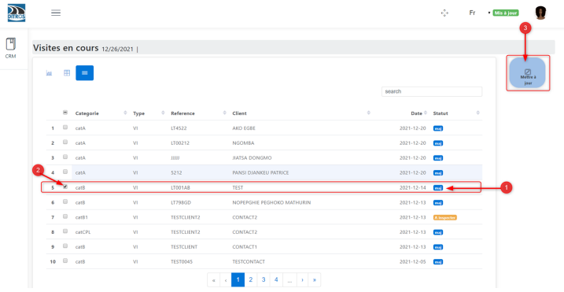
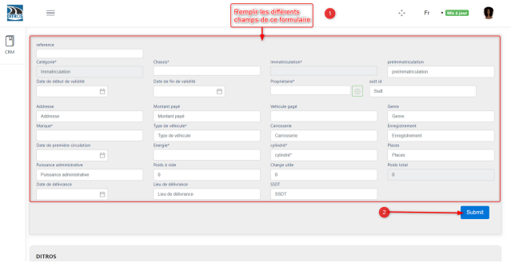

Enregistrement de la carte grise
++++++++++++++++++++++++++++++++

Pour procéder à l'enregistrement de la carte grise, il tout d'abord avoir le rôle qui le permet (mise à jour de la carte grise). Ensuite nous devons suivre les étapes suivantes : 

* **Actualiser la liste des inspections**

Pour cela

    #. cliquez sur **« CRM »**
    #. cliquez sur **«  Visites en cours »**
    #. le véhicule que vous avez enregistré s’affiche sur la liste d’inspections avec le statut **Màj**
    #. sélectionnez le véhicule enregistré précédemment
    #. cliquez sur **« Mettre à jour »**

.. image:: ../img/listeVisites.PNG
    :align: center
    :name: Liste de visite en cours
.. centered:: Liste de visite en cours

.. centered:: Véhicule à mettre à jour

* **Remplir les informations du certificat d’immatriculation**

Ensuite Remplissez les champs suivants tels que spécifiés sur la carte grise du véhicule :

➢ Numéro de châssis*

➢ Précédente immatriculation*

➢ Date de début de validité du certificat*

➢ Date de fin de validité du certififat*

➢ Propriétaire*

➢ SSDT ID*

➢ Adresse*

➢ Montant payé*

➢ Véhicule gagé*

➢ Genre de véhicule*

➢ Marque*

➢ Type de véhicule*

➢ Carrosserie*

➢ N° d’enregistrement*

➢ D.M.C*

➢ Energie*

➢ Cylindrée*

➢ Places assises*

➢ Puissance administrative*

➢ Poids à vide*

➢ Charge utile*

➢ Poids total*

➢ Date de délivrance*

➢ Lieu de délivrance*

➢ Centre SSDT*

Après avoir remplis les champs, cliquer sur **« Submit »**.

.. centered:: Confirmation des informations de la carte grise

**Remarque :** le remplissage des champs se terminant avec **un Astérisque (*)** est **obligatoire.**