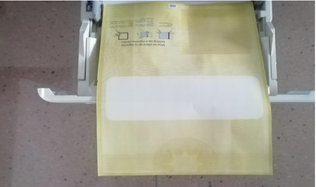
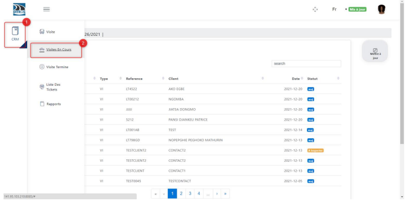
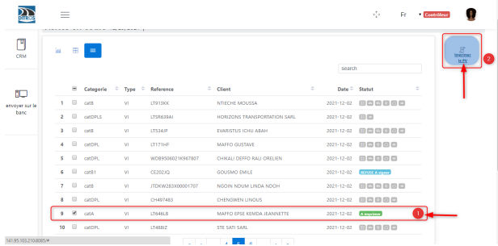
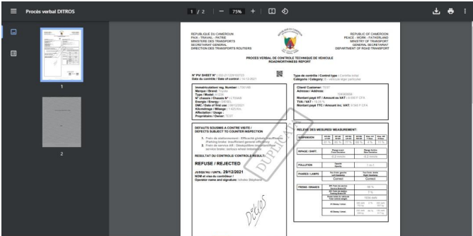

Impression du procès verbal
+++++++++++++++++++++++++++

Pour imprimer un procès verbal, vous devez préalablement avoir e rôle de **« contrôleur »**. Suite à celà deux cas de figure se présentent à nous.

**1** {{Le procès verbal est accepté|underline}}

Dans ce cas de figure nous devons suivre ces étapes :

* Insérer le papier jaune du procès-verbal dans l’imprimante en suivant le sens cidessous :
  

.. centered:: Support physique du procès verbal

* Cliquer sur **« CRM »** puis sur **« Visites en cours »**
  

.. centered:: Liste de visites en cours

* **(1)** Sélectionner le véhicule dont vous voulez imprimer le PV.
* **(2)** Cliquer sur le bouton **« Imprimer le PV»**.

.. centered:: Impression du procès verbal

* L’interface suivante va s’afficher.

.. centered:: Procès verbal final

* Appuyer simultanément les touches **« ctrl »** et **« p »** pour lancer l’impression

**2** **__Le procès verbal est refusé__**

Dans ce cas de figure nous devons suivre ces étapes :

* Insérer un format A4 ordinaire dans l’imprimante
* Cliquer sur **« CRM »** puis sur **« Visites en cours »**
 

.. centered:: Liste de visites en cours

* **(1)** Sélectionner le véhicule dont vous voulez imprimer le PV.
* **(2)** Cliquer sur le bouton **« Imprimer le PV»**.

.. centered:: Impression du procès verbal

* L’interface suivante va s’afficher.

.. centered:: Procès verbal final

* Appuyer simultanément les touches **« ctrl »** et **« p »** pour lancer l’impression
