Inspection du véhicule
++++++++++++++++++++++

L'inspection d'un véhicule passe par quatre étapes illustrées pas la figure ci-dessous : 

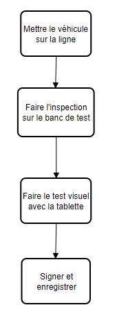
.. centered:: Etapes de l'inspection

**REMARQUE :** au cours du processus de Contrôle Technique, le contrôleur utilisera deux interfaces de l’application DITROS CT pour ses Operations :

* **L’interface web :** grâce à laquelle il affectera le véhicule sur une ligne de test et il signera à la fin du contrôle.

* **L’interface mobile :** grâce à laquelle il prendra les photos et il relèvera les défauts visuels du véhicule

Dans un premier temps, Connectez-vous à l’interface Web avec un compte ayant le droit du contrôleur comme suit :

* **Ouvrir un navigateur sur la tablette** ( de préférence Firefox ou Google Chrome )

.. centered:: Icône de Firefox ou de Google Chrome

* **Entrer l’adresse IP du Serveur dans la barre de recherche du navigateur** : Sur la barre de recherche, entrez l’adresse IP du serveur. Dans notre cas, c’est l’adresse **« 51.195.11.202:8098 »** illustré par **1**. Puis validez comme en **2**.

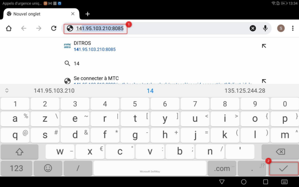
.. centered:: Connexion à l'application

* **Renseigner vos paramètres de connexions** (nom d'utilisateur et mot de passe) : Vous avez en face de vous une interface de connexion. Renseignez vos paramètres de connexion à savoir
  
  * Votre nom d'utilisateur
  * Votre mot de passe
  * cliquez sur **« Connexion »**.

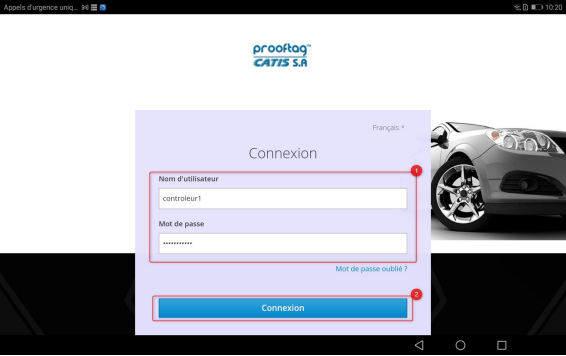
.. centered:: Identification

**NB :** Vous devez disposer du **rôle de controlleur** pour pouvoir effectuer la suite.

Une fois l'authentification terminée, nous pouvons passer à la première étape du processus.

Véhicule sur la ligne
=====================

Nous commencerons cette étape par cliquer sur le bouton **« envoyer sur le banc »** comme illustré ci-dessous : 

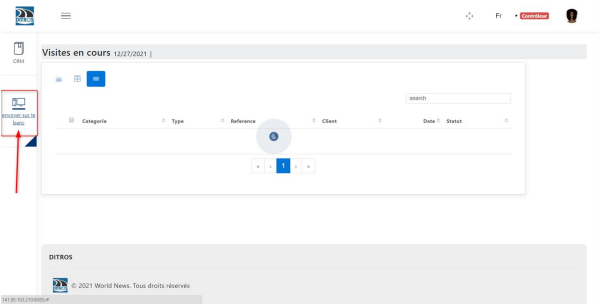
.. centered:: Initialisation de l'envoie sur le banc de test

#. Vérifier l’immatriculation du véhicule dans la liste à question
#. Par défaut le véhicule situé à l’extrémité supérieure gauche de la liste est celui sélectionné pour effectuer l’inspection. Pour effectuer l’inspection d’un autre véhicule, sélectionner l’icône portant l’immatriculation du véhicule concerné.
#. L’immatriculation du véhicule sélectionné s’affiche sur le côté droit de l’interface
#. **Remplir les champs du formulaire d’inspection**, ces champs contiennent : 

    ⮚ La ligne sur laquelle le véhicule sera affectée*,

    ⮚ Le nombre d’essieux*,

    ⮚ Le numéro de châssis*,

    ⮚ Le kilométrage*,

    ⮚ Et les freins d’essieux*

**NB :** La ligne de test que vous choisissez ici au niveau du champ **« ligne utilisé »** est celle que vous devrez utiliser pour le contrôle technique du véhicule sur le banc. Si vous avez choisi la **mauvaise ligne**, le contrôle technique ne pourra pas s’opérer jusqu’à la fin.

#. Cliquez ensuite sur **« Submit »**.

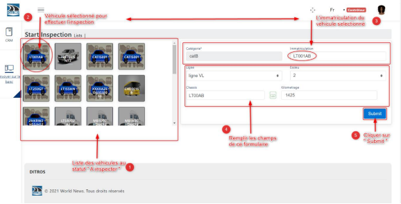
.. centered:: Sélection du véhicule à envoyer sur le banc de test

Une fois validé, vous aurez l’interface suivante qui présente les différents tests qui doivent être effectués sur le(s) banc(s) de la ligne sur laquelle vous avez affecté le véhicule.

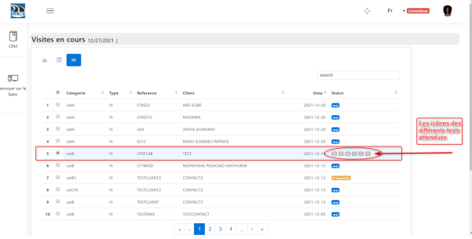
.. centered:: Tests à effectuer

**Bon à savoir :** Sémantique des différentes icônes de tests qui s’affichent sur l’application DITROS CT

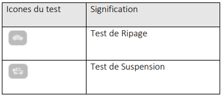
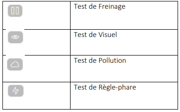
.. centered:: Sémantique des icônes

Banc de test
============

Lorsque les différents tests à effectuer sont affichés sur l’application DITROS CT, le
contrôleur devra aller au niveau du banc de test de la ligne qu’il a choisi précédemment et
sélectionner le numéro d’immatriculation en question. Puis il commencera l’inspection proprement dite du véhicule.

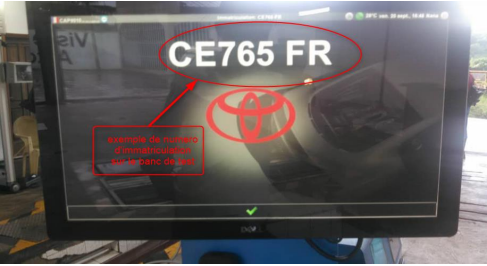
.. centered:: Exemple de tableau de bord de l'équipement d'inspection

L’inspection terminée sur le banc de test, le contrôleur transmet les tests vers le serveur en
cliquant sur le bouton de transmission des données appropriés.

**Le bouton de transmission des données dépend du fabricant et du logiciel utilisé sur le banc de test.**

**NB :** Ces informations transmises seront visibles au niveau de l’interface **« Visites en cours »** de DITROS CT.

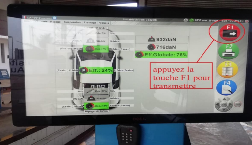
.. centered:: Transmission des informations à DISTRO CT

Inspection visuelle
===================

Une fois que le contrôle du véhicule a été effectué sur le banc de test, le contrôleur se connecte
à l’application mobile DITROS CT pour effectuer les tests visuels qui consiste à renseigner les défauts
visuels et la prise des photos du véhicule. Pour cela, il faut : 

* **Ouvrir l’application DITROS sur la tablette :** cliquer sur l’icône de l’application situé dans le menu de la tablette.

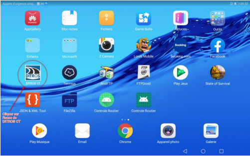
.. centered:: Icône de DISTRO CT

* **Sélectionner l’identifiant du contrôleur qui effectue les tests sur l’interface de connexion déroulante qui s’affiche**
  * **(1)** toucher le champ proposé du formulaire 
  
  .. image:: ../img/select.PNG
    :align: center

  * **(2)** sélectionnez votre identifiant parmi la liste déroulante
  
  .. image:: ../img/choixIdentifiant.PNG
    :align: center

  * **(3)** saisir le mot de passe et appuyer sur **« login »**
  
  .. image:: ../img/Loging.PNG
    :align: center

  * **(4)** Sélectionner la ligne concernée
  
  .. image:: ../img/choixLigne.PNG
    :align: center

  * **(5)** Sélectionner l’immatriculation du véhicule en cours de tests & valider comme suit : 
  
  .. image:: ../img/test_validation.PNG
    :align: center

  * Dans l’interface principale de contrôle visuel
  
    * Vérifier l’immatriculation du véhicule
    * Effectuer facilement la recherche des défauts observés dans la liste, sélectionner et visualiser les défauts choisis
    * Remplir les données de règle phare et d’analyseur de gaz
    * Effectuer des prises de photos, visualiser
    * Une fois toutes les informations renseignées, valider sur le bouton comme suit : 
  
  .. image:: ../img/detailsIHM.PNG
    :align: center

  * **Prise de photos sur la tablette**
  
Avant de prendre les photos vérifier d’abord que le numéro d’immatriculation qui s’affiche
sur la tablette est le même que celui que vous voulez contrôler.
Pour prendre les photos du véhicule, cliquez sur l’icône de l’appareil photo situé en bas à
droite de l’interface de la tablette

  .. image:: ../img/prisePhoto.PNG
    :align: center

  * **Bon à savoir :** Avant la prise des photos le statut est **« No Picture »** comme suit : 
  
  .. image:: ../img/statutPhoto.PNG
    :align: center

  * Cliquer sur l’icône pour capturer l’image comme présenté ci-dessous :

  .. image:: ../img/photoVoiture1.PNG
    :align: center

  * cliquez sur l’icône pour valider la photo comme présenté ci-dessous :

  .. image:: ../img/photoVoiture2.PNG
    :align: center
    :name: Aperçu de la photo
  .. centered:: Aperçu de la photo

Après la prise des photos voici comment doit se présenter le coin photo. Il faut se rassurer que le statut soit passé de **« No picture »** à **« image 1 »** et **« image 2 »**. 

* **Relever les défauts visuels**

  .. image:: ../img/defautsVisuels.PNG
    :align: center
    :name: Sélection des défauts visuels
  .. centered:: Sélection des défauts visuels

  * Cliquez respectivement sur les boutons **(1)** & **(2)** pour renseigner les valeurs mésurées

  .. image:: ../img/polution_phare.PNG
    :align: center
    :name: Polution et Phare
  .. centered:: Polution et Phare

  * **(1)** Renseigner les mesures d’analyseur de gaz et cliquer sur **« submit »**

  .. image:: ../img/polution.PNG
    :align: center
    :name: Mesure du taux de polution
  .. centered:: Mesure du taux de polution

  * **(2)** Sélectionner les valeurs de règle phare et cliquer sur **« submit »**

  .. image:: ../img/mesurePhare1.PNG
    :align: center
  .. image:: ../img/mesurePhare2.PNG
    :align: center
    :name: Niveau des phares
  .. centered:: Niveau des phares
    
**IMPORTANT :** Il est important de préciser que les données relevées automatiquement par le protocole
GIEGLAN pour les Poids Lourds (ripage et freinage) et véhicules légers (ripage, suspension et
freinage) ne doivent plus être introduit manuellement sur la tablette. Car elles sont générées
automatiquement.

**NB :**

**(1)** Une fois les tests visuels effectués, le contrôleur transmet les données vers le serveur.

**(2)** La couleur des icônes de test change progressivement après le traitement des fichiers Gieglan.

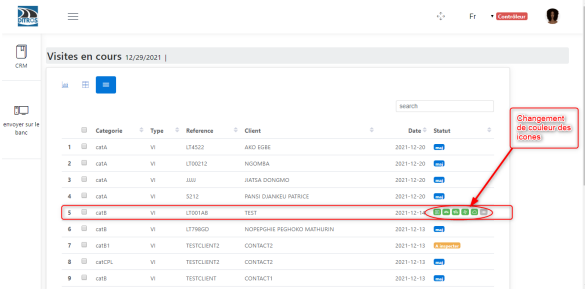
.. centered:: Changement de la couleur des icônes

Signature et Enregistrement
===========================

Sur la tablette, revenez sur l’application web. Les tests viennent d’être réalisés et donc le statut est **«A signer »**.

**(1)** Sélectionner le véhicule dont les tests viennent d’être réalisés et dont le statut est **« A signer »**.

**(2)** Ensuite Cliquez sur le bouton **« Signer le PV »**.

* **1er cas : « Inspection REFUSEE »**

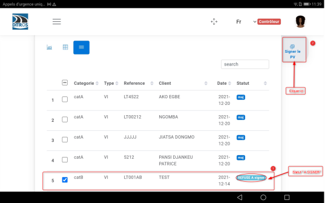
.. centered:: Inspection refusée

* **1er cas : « Inspection ACCEPTEE »**

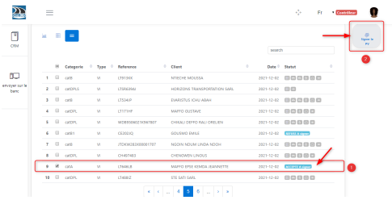
.. centered:: Inspection acceptée

**(3)** Cliquer sur **« Signer le PV »** pour avoir accès à l’interface réservée à la signature du contrôleur. Signer et cliquer sur **« Enregistrer »**.

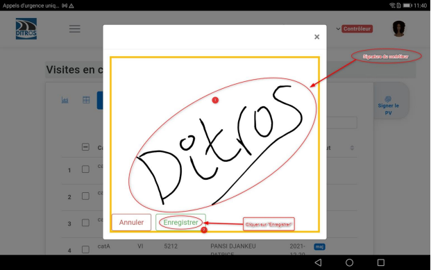
.. centered:: Espace de signature du controleur

**(3)** Une fois l'enregistrement terminée, vous recevez une notification de **« signature ok »**.

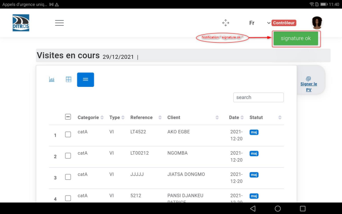
.. centered:: Confirmation de la signature
