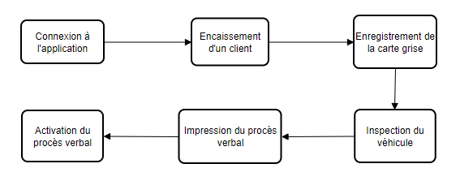
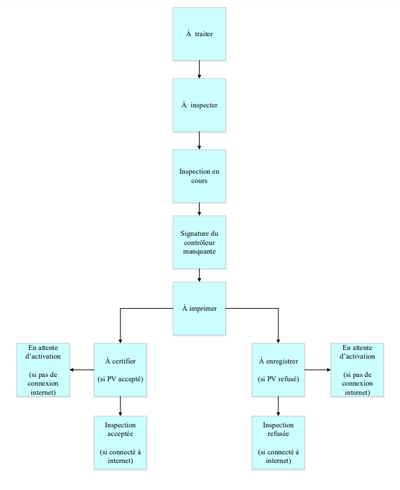

Pré requis
++++++++++

Diagramme d'activités du processus
==================================

Le Diagramme ci-dessous présente les différentes étapes d’établissement d’un Procès-verbal
(PV) pour un contrôle initial.

.. centered:: Diagramme d'activités du processus

Avant de commencer le processus, toujours se rassurer que le serveur, le banc de test,
l’ordinateur sur lequel on va se connecter et la tablette sont tous dans le même réseau
informatique (filaire ou wifi).

Diagramme d'état-transition du véhicule
=======================================

Il est également important de connaitre les différents statuts par lesquels passeront les
véhicules enregistrés sur l’application 

.. centered:: Diagramme d'état-transition du véhicule

Le tableau ci dessous vous explique la sémantique des statuts :

.. list-table:: Statut des véhicules
    :widths: 15 85
    :header-rows: 1
    :class: fixed-width-table

    * - **Statut**
      - **Signification**
    * - 1 **A traiter**
      - Le véhicule est déjà enregistré à la caisse, le compte d’enregistrement des informations de carte grise dois **entrer les informations de la carte grise.**
    * - 2 **A inspecter**
      - Les informations de la carte grise sont déjà enregistrées ; le contrôleur doit **commencer l’inspection du véhicule.**
    * - 3 **Inspection en cours**
      - C’est lorsque le contrôleur a déjà lancé l’inspection sur la tablette et le véhicule doit maintenant être passé au contrôle technique sur la ligne de tests correspondantes.
    * - 4 **Signature du contrôleur manquante / A signer**
      - **Le contrôleur doit signer le procès-verbal de contrôle technique du véhicule**
    * - 5 **A imprimer**
      - Le **PV doit être imprimé** par l’exploitation
    * - 6 **A certifier**
      -
    * - 7 **A enregistrer**
      -
    * - 8 **Inspection acceptée**
      -
    * - 9 **Inspection refusée**
      -
    * - 10 **Attente d'activation**
      -

Pour produire un PV jusqu’à son activation, suivez les étapes suivantes dans la section **PROCESSUS D'OBTENTION D'UN PV.**