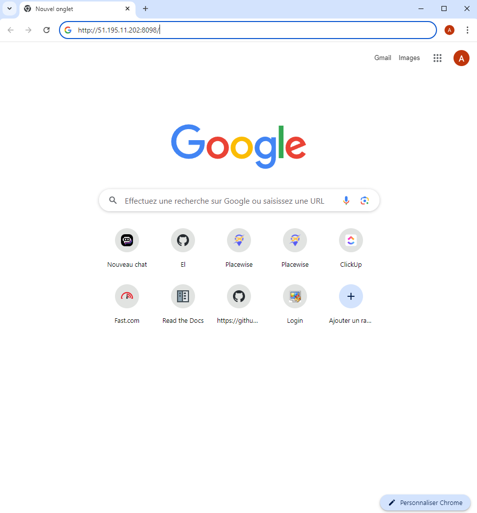
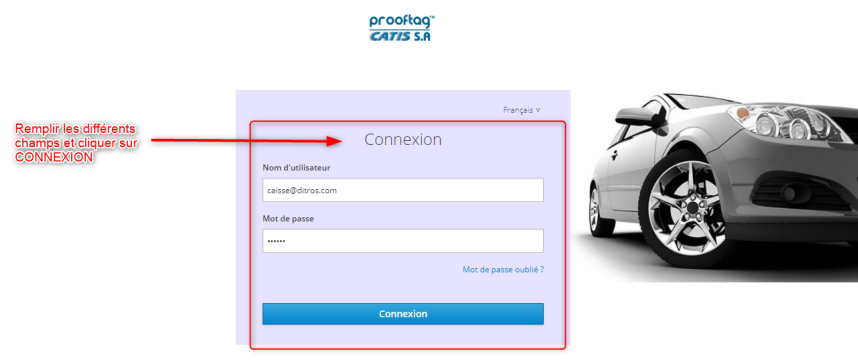

Connexion à l'application
+++++++++++++++++++++++++

Ouvrir un navigateur sur votre ordinateur
Il est conseillé de choisir de préférence les navigateurs Firefox ou Google Chrome

.. image:: ../img/navigateur.jpg
    :align: center
    :name: Icône de Firefox ou de Google Chrome
.. centered:: Icône de Firefox ou de Google Chrome

.. centered:: Mettre l'adresse

Entrer l’adresse IP du serveur dans la barre de recherche du navigateur

Sur la barre de recherche, entrer l’adresse IP du serveur. Dans notre cas, c’est l’adresse « 51.195.11.202:8098 ». Puis appuyer la touche « entrer » du clavier : 

Dans l'interface qui s'affiche, renseignez vos paramètres de connexion : 

* votre nom d'utilisateur
* Votre mot de passe

Puis cliquer sur **« CONNEXION ».**

.. centered:: Interface de connexion à l’application DITROS CT
